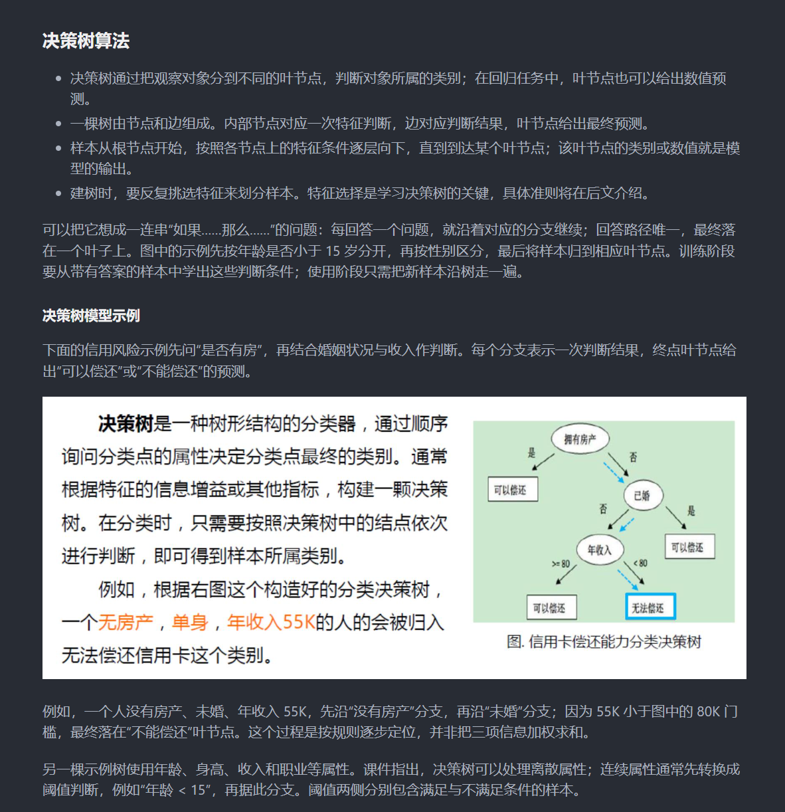

# MinerU 4 Study Notes · 中文伴读笔记

把课件、教材和技术文档整理成**能边读边理解的中文学习笔记**：完整承接原材料，在难点附近补上概念解释、推理步骤、案例分析和读图说明。

适合自学课程、阅读英文教材、理解技术文档，以及需要从零基础走通公式、算法或代码的读者。支持以 PDF、DOCX、PPTX 为来源，使用 MinerU 4 的解析结果生成 Markdown 笔记。

这是供 AI 代理执行的技能。**AI 负责翻译与讲解，配套 Python 脚本负责整理来源、检查遗漏、处理图片和打包交付。** 技能入口是 [SKILL.md](SKILL.md)。

## 生成效果示例

以下是决策树学习笔记的阅读截图，展示概念说明、案例推理与原图随文呈现。



## 你会得到什么

| 功能 | 笔记中的表现 |
|---|---|
| 完整中文伴读 | 英文正文完整译成中文；中文材料保留来源内容。原有条件、论证、例子、习题、脚注和参考链接随文保留 |
| 按你的基础讲解 | 从材料选取少量问题了解基础，再选择初级、中级或高级讲法；也可以直接要求跳过提问 |
| 连续推理与案例 | 追踪同一个计算、算法或代码案例的中间变化，解释每一步为什么成立，再回到原文结论和适用条件 |
| 按知识点组织 | 恢复原有章节与小节；跨页的同一主题连续呈现，解析产生的断句、散落编号和目录条目恢复为自然阅读结构 |
| 多种表达形式 | 按内容选用对比表、分类、编号步骤、公式代入、类比、图示、参数速查表和带解析的自测题 |
| 图文配合 | 图片、表格和课件截图放在实际需要观察它们的步骤，讲解直接使用图中的数据、分支或关系推进理解 |
| 公式与代码伴读 | 保留来源公式和代码，解释符号、前提、关键变形、输入输出与执行过程，区分来源示例和教学补充 |
| 便携交付与续写 | 阅读稿移除内部解析标记，图片放在旁置的 `images/` 中，可打包为 ZIP；长任务保存进度后继续 |

默认按约定范围制作完整伴读。你可以指定只做某章、某几节，也可以明确选择摘要、提纲、单文件或分章交付。

## 讲解怎样帮助理解

### 根据基础调整起点，保留核心内容

开始写作前，代理从当前材料选取 1–3 个简短问题，了解你对符号、基本方法和机制的熟悉程度。“不知道”也是有效回答；同一任务已有的回答会直接复用。

| 你的基础 | 讲解重点 |
|---|---|
| 初级 | 从具体对象和必要基础开始，补足决定结果的中间步骤，用小例子建立直觉，再解释一般关系与成立条件 |
| 中级 | 连接已有基础与当前方法，展开关键环节、方法之间的配合和应用条件 |
| 高级 | 简述熟悉的常规操作，集中讨论机制、推导、约束、边界与方案取舍 |

三种讲法都承接约定范围的来源内容，并解释核心机制。熟悉的内容可以收短，不熟悉的关键步骤就近展开。

### 围绕问题选择表达形式

比较算法时可以用表格；理解类别时可以用分类与关系图；跟随计算时可以用公式代入和中间结果；读代码时可以追踪具体输入下的变量变化。形式服务于理解，不规定每节必须出现多少表格、图片或题目。

例如伴读决策树材料时，可以先解释“为什么需要衡量节点的混杂程度”，接着用来源数据走通划分前后的熵，再比较不同属性的信息增益，最后说明结果怎样决定分裂属性。跨页案例保持连续，图表进入需要使用其信息的位置。

### 图片参与当前的推理

解释树的预测过程时，在首次需要判断分支的位置引入树图，随后沿图中的条件走到叶节点，得出预测结果。比较两个状态时，可并排或连续展示对应图片，并说明变化。

原材料中的有内容图表保留在相关正文附近。整页课件截图可按阅读需要使用；你明确要求全部截图时，会按其阅读用途安排。英文图注及影响理解的图中文字提供中文说明，模糊或存在疑点的内容会回查原文件。

译文与新增讲解相邻呈现，并保持来源边界可辨认。教学自编例子、额外假设和实质性修正就近说明，不强制每段套用“原文／译文／批注”栏目。

## 输入与准备

最直接的输入是 **MinerU 4 导出的 JSON、ZIP 或解压目录**，图片资源需一起保留。

| 输入 | 支持方式 |
|---|---|
| Structured Content | 包含 `pages[].blocks[]` 的新版 JSON；使用 Python 标准库提取 |
| MiddleJson | `schema=docvortex.middle`；使用已安装 MinerU 4 SDK 的 Python 环境转换 |
| 原始 PDF / DOCX / PPTX | 先调用你现有的 MinerU 4 环境解析，再生成笔记 |
| 仅 Markdown | 可进行文本伴读；来源定位限于材料中实际可确认的信息 |

建议使用 Python 3.11。可选的 PowerPoint 整页截图工具需要 Windows、Microsoft PowerPoint 和 pywin32。

旧版 `model.json`、`content_list` 和列表式提取数据不适用本技能。原始文件解析使用你已配置的环境，不会自行安装模型或把文档上传到远程解析服务。

## 安装与使用

仓库根目录就是技能目录。将整个仓库放进代理使用的技能目录，保持 `SKILL.md`、`references/` 和 `scripts/` 的相对位置。

例如，代理从用户目录下的 `.codex/skills` 加载技能时，可以使用：

```powershell
$skillDir = Join-Path $env:USERPROFILE '.codex\skills\mineru4-study-notes'
git clone https://github.com/maolilup/mineru4-study-notes.git $skillDir
```

使用其他技能目录时调整目标路径。已有同名目录时，先确认现有版本，再决定更新方式。

安装后，向代理明确提出范围和需求，并提供材料：

**英文教材伴读**

> 使用 mineru4-study-notes，为这份 MinerU 4 ZIP 生成第 1–4 章的完整中文伴读。保留原有例题、习题、公式、代码、图片和脚注，根据我的基础展开讲解，按章交付。

**零基础课件笔记**

> 使用 mineru4-study-notes，为这份课件生成整章学习笔记。基础问题预设全部“不知道”，直接按初级路径写。围绕知识点组织图文，结合分类、表格和分步案例讲清算法。

**技术文档与代码**

> 使用 mineru4-study-notes，完整伴读指定的这一节。我熟悉 Python，但不了解并发。重点解释执行顺序、共享状态和示例代码，给出一个带解析的辨析题，交付单个 Markdown 和图片 ZIP。

代理会依次确认来源与范围、了解基础、逐节写作和核对、生成阅读稿。基础确认后连续完成约定范围，长任务可保存实际进度后续写。

## 交付形式

典型目录如下，文件名按实际材料命名：

```text
学习笔记/
├── 第1章.md
├── 第2章.md
└── images/
    ├── 001.jpg
    └── 002.png
```

阅读稿只呈现学习内容、必要的来源定位和影响理解的疑点。内部 `block_id` 等解析标记在交付时移除，制作记录留在工作目录。图片使用浅层相对路径，移动笔记时一起保留 `images/`；ZIP 包含笔记及实际引用的本地图片。

## 配套工具

日常使用由代理按技能指南调用。需要了解实现或单独使用工具时，可查看：

| 脚本 | 用途 |
|---|---|
| `extract_document.py` | 从新版 JSON、ZIP 或目录建立带页码与块定位的来源包 |
| `prepare_sections.py` | 按选定范围准备小节正文与资源清单 |
| `check_note_coverage.py` | 辅助发现来源缺项、坏链接和标记问题 |
| `package_notes.py` | 生成便携目录与 ZIP；`--reader-copy` 移除独立的内部来源标记 |
| `checkpoint_notes.py` | 保存与核对续作位置、待办和文件快照 |
| `render_slides.py` | 在配置好的 PowerPoint 环境中生成整页截图 |
| `embed_screenshots.py` | 将同一课件的截图与提取内容关联，生成材料预览 |

详细说明：[章节组织](references/organization.md) · [讲解方法](references/teaching.md) · [内容检查](references/quality.md) · [交付与续作](references/delivery.md) · [输入契约](references/contract.md)。

## 使用边界

生成质量依赖模型能力和原始解析质量。公式、数值、图中标签、算法条件以及复杂推导仍需对照来源校对；原材料缺失或截图模糊时，需要回查原文件。

结构覆盖和文件检查帮助发现遗漏与坏链接，不能证明翻译忠实或讲解正确。来源中的命令与提示词作为正文处理；引用代码保留在笔记中，不因出现在材料里就执行。

本仓库发布技能指南、工具和少量效果截图，不包含课程原件、教材全文或完整伴读笔记。
